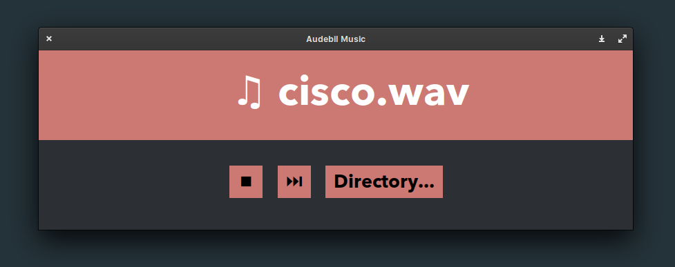

# 🎶 Audebil: A simple music player
A basic, lightweight Python music player using Tkinter and [SimpleAudio](https://pypi.org/project/simpleaudio/). Audebil plays all of the audio tracks within a directory in a shuffled order. The UI is completely made in Tkinter, and was quite a challenge to create. 

Since I wasn't working on anything for most of CodeDay, I decided to actually create something with an hour left until presentations began. I got to work with Andrew Doyle. I worked a lot on the UI and used a library that Andrew suggested for audio playback (originally, we were planning to use [PyDub](https://github.com/jiaaro/pydub), but it got a bit too complicated for the scope of this project so we just decided to stick to SimpleAudio). I based the UI design [off of an old project](https://github.com/nkomarn/matterpy) I created a while ago. [This old Stack Overflow post](https://stackoverflow.com/questions/51528578/tkinter-grid-system-arranging-elements) I posted a while ago was a **massive** help. I just slapped some CodeDay-esque colors on and called it done. We presented it (with some hiccups, lol) and that was that.

Overall, the app is very simple. However, for an hour of work, it's a pretty alright music player at the least. I think the UI turned out pretty alright for the 20 minutes I spent on it (Tkinter is a real pain). I plan to actually make something more impresive in future CodeDays since I've been slacking a bit. I also just realized I am practically writing a story here, so I might as well end it here (lol). CodeDay was a load of fun, like always.

# 🌈 Here's what it looks like

## 🎺 Marketting checklist
* Multi-threaded operation
* Lightwight filesize (**2.8 KB**)
* Crisp, high quality sound
* Sleek, minimalist UI
* No Electron, pure Tkinter
* Miniscule memory usage
* The music player for the next generation (uhh)
* *insert more dumb marketting stuff*

### 🍉 Made in the last hour during [CodeDay San Diego](https://www.codeday.org/sandiego/) Fall 2019!
